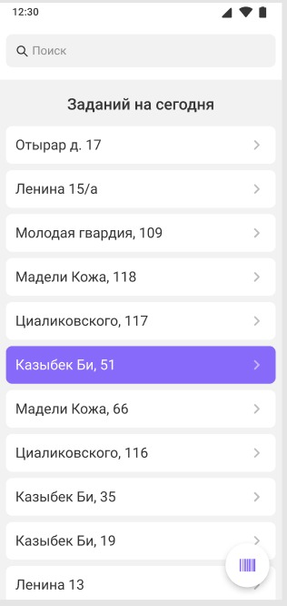
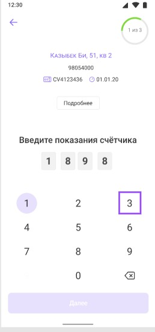
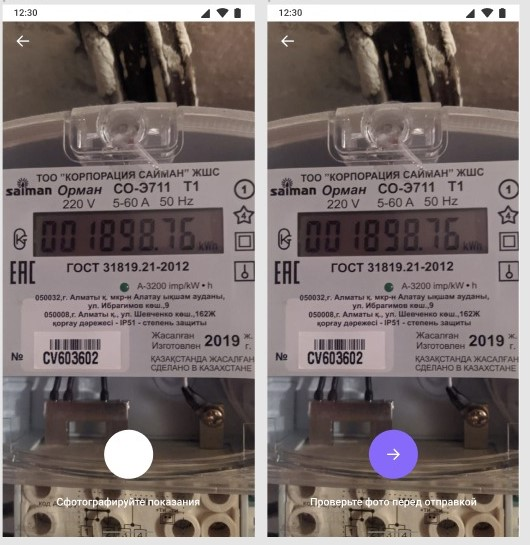
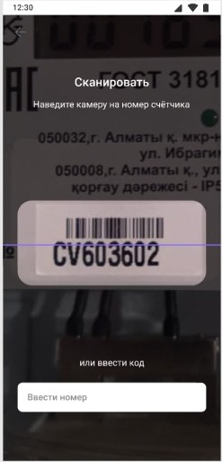

# **SmartCon**
SmartCon is an application designed for inspectors to instantly record data from utility meters into a database during inspections.
# **SmartCon**
App screens:

|       |       |       |
| :---: | :---: | :---: |
|  |  |  |
| *Caption 1* | *Caption 2* | *Caption 3* |
|       |       |       |
| :---: | :---: | :---: |
|  |  |  |
| *Caption 1* | *Caption 2* | *Caption 3* |
