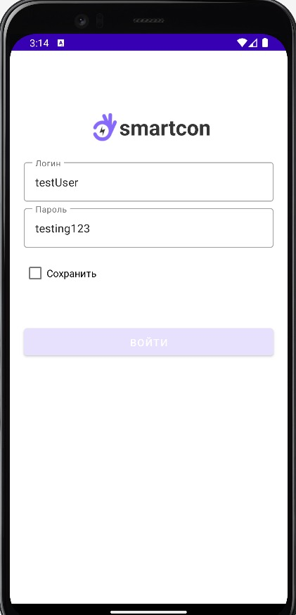

# **SmartCon**
SmartCon is an application designed for inspectors to instantly record data from utility meters into a database during inspections.
# **App Screens**

|       |       |       |
| :---: | :---: | :---: |
|  |  |  |
| *Login Screen* | *Home Screen* | *Screen 3* |
|       |       |       |
| :---: | :---: | :---: |
|  |  |  |
| *Camera Screen* | *Scanner Screen* | *Result Screen* |

|       |       |       |
| :---: | :---: | :---: |
|  |  |
| *Sended Data to Db* | *Bottom Sheet* |

# **Stack**
**MVVM pattern**: The architecture of the application is written in MVVM pattern

**Retrofit(body form-data)**: to get data from the network and send data to the database

**Fragments with navigation graph.**

**OkHttp**: to check sended data status

**LiveData** **Glide** **Bundle**
**Working with protected OS partitions** - I worked in this app with Os Partitions like to get instance to **Camera**,i added **Scanner BarCode**,and also add **flashlight** function

